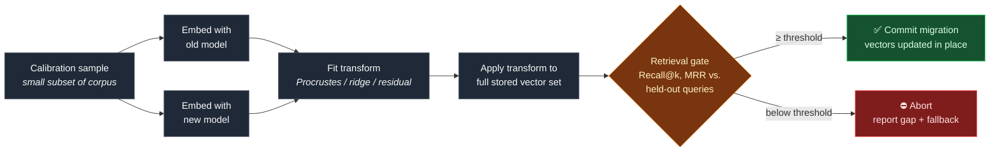
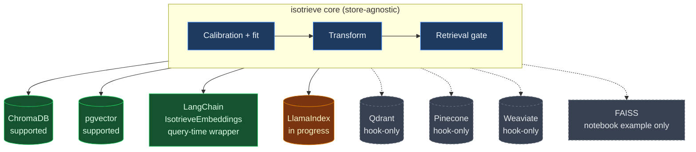

# Isotrieve — Embedding migration without re-embedding

[](https://pypi.org/project/isotrieve/)
[](https://github.com/krish1925/Isotrieve/actions/workflows/ci.yml)
[](isotrieve-python/LICENSE)
[](isotrieve-python/)
[](https://krish1925.github.io/Isotrieve/)

**Every few months, a better embedding model comes out. Your vector store never gets to use it.**

Not because the new model isn't better. Because "upgrade the embeddings" means re-embedding everything, rebuilding the index, and hoping retrieval doesn't quietly get worse. So teams don't. They stay on a model from eighteen months ago, because moving is a project nobody signed up for.

Isotrieve fixes the actual bottleneck. It learns the transform between your old embedding space and the new one from a small sample — not your whole corpus — applies it to the vectors you already have, and tells you the retrieval score before you commit. Pass the gate, ship it. Miss the gate, walk away. Either way, you know.

---

## Why this exists

Here's what "upgrade the embedding model" actually turns into, in practice:

- Re-embed the entire corpus. Millions of documents. Real time, real API spend.
- Rebuild the index from scratch.
- Cut over blind — no way to know if retrieval survives the swap until it's live.
- Do it all again the next time a better model ships. Because there's always a next time.

That last one is the part people miss. This isn't a one-time cost. It's a tax you pay every time the field moves — which is often. So most teams just stop moving. Not because the old model is good enough, but because the alternative is an open-ended project with a real chance of making things worse, silently, in production.

Isotrieve turns "should we upgrade?" from a quarter-long bet into a five-minute answer.

## What it actually does

Isotrieve doesn't re-embed anything. It learns the geometric relationship between two embedding spaces from a small sample, maps your existing vectors into the new space directly, and gates the whole thing on measured retrieval retention — Recall@k, MRR, against held-out queries. Clear the bar, it ships. Don't, and you get a report telling you why, not a broken index.



1. **Calibrate** — embed a small sample of your corpus (or a provided default set) with both the old and new models. No full-corpus embedding calls required.
2. **Fit** — learn a transform (Orthogonal Procrustes, ridge/affine, or a small residual model) mapping new-model space onto old-model space, or vice versa.
3. **Transform** — apply the learned map to your stored vectors in place, without touching the source text or calling the new embedding model on the full corpus.
4. **Gate** — measure retrieval retention against a held-out query set. The migration only proceeds if retention clears a configurable threshold; otherwise Isotrieve reports why and falls back safely — your index is never left in a half-migrated state.

## Who this is for

- **Teams running RAG or semantic search in production**, who want the newer model without losing a sprint to a re-embedding project.
- **Anyone whose re-embedding cost scales with corpus size.** Calibration touches a small sample no matter how big your corpus is — so the bigger you are, the more this saves you.
- **Platform teams who want migration to be a CI-gated, repeatable operation** — not a script someone runs by hand at 11pm and hopes for the best.

If your corpus is small and re-embedding costs you two dollars and ten minutes — just re-embed. You don't need this. Isotrieve earns its keep when re-embedding is expensive or risky enough that people avoid doing it at all.

## Why not just use the research this is built on?

The core idea — a learned transform between embedding spaces instead of re-embedding — comes from published research: [vec2vec](https://arxiv.org/abs/2505.12540), mini-vec2vec, Drift-Adapter, and the Platonic Representation Hypothesis. None of them ship as usable tools:

- **vec2vec** — GAN training scripts and config files. No package.
- **mini-vec2vec** — a notebook and an embedding-generation script. No package.
- **Drift-Adapter** — a paper (95–99% retrieval retention, per their own eval). No public repo at all.

Isotrieve is the engineering layer on top: a pip-installable package, a CLI, a retrieval-gated migration workflow, and adapters for the stores teams actually run (ChromaDB, pgvector, LangChain, more in progress). Not a new algorithm — the difference between a technique and something you can run in CI against a real corpus.

## Project structure

```
Isotrieve/
├── isotrieve-python/          # Maintained Python package (PyPI: isotrieve)
├── isotrieve-npm/             # Historical NPM protocol package (experimental)
├── isotrieve-website/         # GitHub Pages site
├── benchmarks/           # Benchmark harness and results
├── spec/                 # Protocol specification (RFC-001)
├── docs/                 # Technical overview, protocol spec
├── .github/              # CI workflows, issue templates, gate action
└── AGENTS.md             # Development contract for AI agents
```

**Which package is current?** `isotrieve` on PyPI is the actively maintained, benchmark-validated package. The NPM package (`isotrieve-npm/`) is historical/experimental.

## Package

[`isotrieve-python/`](isotrieve-python/) — pip-installable as `isotrieve`.

```bash
pip install isotrieve
```

See [`isotrieve-python/README.md`](isotrieve-python/README.md) for the full quickstart, CLI usage, and adapter-specific guides.

## Vector store adapters

Isotrieve separates the transform logic (store-agnostic) from the adapter layer (store-specific read/write), so the same learned mapping can be applied to whatever you're actually running in production:



Solid arrows mean an in-place migration path exists today; dashed arrows mean only a hook or example is available.

| Store | Status |
|---|---|
| ChromaDB | Supported |
| pgvector | Supported |
| LangChain (`IsotrieveEmbeddings`) | Supported (query-time wrapper, store-agnostic) |
| LlamaIndex | In progress |
| Qdrant | Hook-only |
| Pinecone | Hook-only |
| Weaviate | Hook-only |
| FAISS | Notebook example only (no persistence layer to migrate against) |

## On claims and benchmarks

Quantitative performance claims in this repo appear **only** when backed by committed artifacts under [`benchmarks/results/`](benchmarks/results/) and listed in [`isotrieve-python/CLAIMS.md`](isotrieve-python/CLAIMS.md). If a number isn't in `CLAIMS.md` with a linked artifact, treat it as unverified — that also means: don't take our word for it, rerun the gate on your own corpus and model pair before you migrate.

## Prior art

Isotrieve builds on [vec2vec](https://arxiv.org/abs/2505.12540), mini-vec2vec, Drift-Adapter, and the Platonic Representation Hypothesis. Our contribution is engineering — library, CLI, quality gate, adapters, and benchmarks — not algorithmic novelty. If you're citing the underlying technique, cite that prior work; if you're citing the tool, cite this repo.

## Status

Early-stage, actively developed. APIs may change between minor versions until 1.0. Issues and PRs welcome — see [`CONTRIBUTING.md`](CONTRIBUTING.md).

## License

Apache-2.0 (Python package). See [`isotrieve-python/LICENSE`](isotrieve-python/LICENSE).
