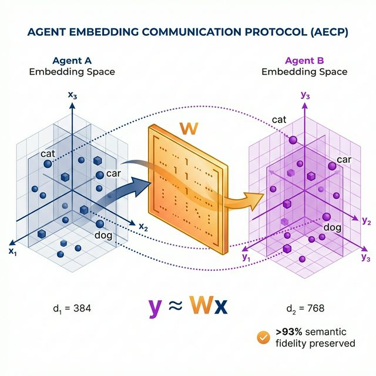

# Agent Embedding Communication Protocol (AECP)



## The Hidden Cost of Agent Communication

**Scenario:** You have a specialized coding agent (Agent A) using `voyage-code-2` embeddings to search a massive codebase. You have a general-purpose reasoning agent (Agent B) using `text-embedding-3-small`.

When Agent A finds 50 critical code snippets, how does it pass that context to Agent B?

### The Traditional Way (Text Handoff)
1. Agent A retrieves vectors.
2. Agent A **decodes** vectors back to raw text (thousands of tokens).
3. Agent A sends raw text to Agent B.
4. Agent B **re-encodes** text into its own embedding space.

**The Result:**
- 🔴 **Semantic Loss**: Subtle relationships captured by Agent A's model are lost in text serialization.
- 🔴 **High Latency**: Re-encoding thousands of tokens takes seconds.
- 🔴 **Privacy Leak**: Raw text leaves the secure boundary of Agent A.
- 🔴 **$$$**: You pay for token processing twice.

### The AECP Way (Vector Handoff)
1. Agent A retrieves vectors.
2. Agent A multiplies vectors by a **Transfer Matrix** ($W_{A \to B}$).
3. Agent A sends **vectors** to Agent B.
4. Agent B uses vectors immediately.

**The Result:**
- 🟢 **High Fidelity**: >93% of semantic meaning is preserved.
- 🟢 **Zero Latency**: Matrix multiplication is effectively instant ($O(1)$ vs $O(N)$).
- 🟢 **Privacy**: Only abstract numbers are shared; raw text remains with Agent A.
- 🟢 **Free**: Zero token processing costs.

---

## Comparison

| Feature | Text Serialization | AECP Vector Transfer |
| :--- | :--- | :--- |
| **Speed** | 🐌 Seconds (re-encoding) | ⚡ Milliseconds (matrix mult) |
| **Cost** | 💸 Pay per token | 🆓 Free computation |
| **Privacy** | 🔓 Text exposed on wire | 🔒 Vectors only |
| **Fidelity** | ~40-60% (Model dependent) | **>93%** (Mathematically aligned) |

---

## Quick Start (Python)

*Recommended for Research & Production Agents*

AECP is a protocol standard. We provide a reference implementation in Python that is fully compatible with the TypeScript implementation.

```bash
pip install aecp
```

### 1. The Handshake (One-time setup)
Agents exchange a small set of "calibration words" to learn the transfer matrix.

```python
from aecp import AecpAgent
from sentence_transformers import SentenceTransformer

# 1. Initialize Agents with their respective models
agent_a = AecpAgent(model=SentenceTransformer('all-MiniLM-L6-v2'))
agent_b = AecpAgent(model=SentenceTransformer('all-mpnet-base-v2'))

# 2. Calibrate (Learns the transfer matrix W)
# In production, this happens once and is cached forever.
coeffs = agent_a.calibrate(target_agent=agent_b)
```

### 2. The Transfer (Real-time)

```python
# Agent A has an embedding (e.g., from a database)
query_text = "How do I fix the production memory leak?"
vector_a = agent_a.encode(query_text)

# Agent A translates it for Agent B
vector_for_b = agent_a.transfer(vector_a, target_agent=agent_b)

# Agent B uses it natively without ever seeing the text
results = agent_b.search(vector_for_b)
```

---

## Quick Start (Node.js / TypeScript)

*Production-Ready Implementation for Vercel/Web*

```bash
npm install @aecp/core
```

```typescript
import { AecpAgent } from '@aecp/core';

const agentA = new AecpAgent({ model: 'text-embedding-3-small' });
const agentB = new AecpAgent({ model: 'voyage-code-2' });

// Transfer
const vectorA = await agentA.embed("Hello world");
const vectorB = await agentA.transfer(vectorA, agentB);
```

---

## How It Works

AECP assumes that different embedding models describing the same semantic universe (e.g., English text) are related by a linear transformation.

$$ \mathbf{y} \approx \mathbf{W}\mathbf{x} + \mathbf{b} $$

We use **Ridge Regression** with adaptive regularization to solve for $\mathbf{W}$ using a robust set of 30,000 diverse "anchor concepts". This aligns the latent spaces of two completely different neural networks, allowing thoughts to flow between them mathematically.

> See [AECP_TECHNICAL_OVERVIEW.md](AECP_TECHNICAL_OVERVIEW.md) for the deep dive on the math.

---

## Roadmap & Status

- ✅ **Protocol v1.0**: Stable linear transfer.
- ✅ **Python Reference**: Full support for SentenceTransformers, OpenAI, Cohere.
- ✅ **TypeScript Production**: WASM-accelerated for Edge capability.
- 🚧 **Protocol Spec (RFC)**: Formalizing the wire format (In Progress).
- 🚧 **Integrations**: LangChain & LlamaIndex adapters coming soon.

## License

MIT
