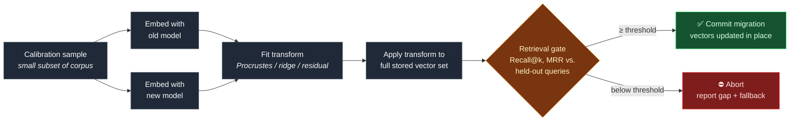
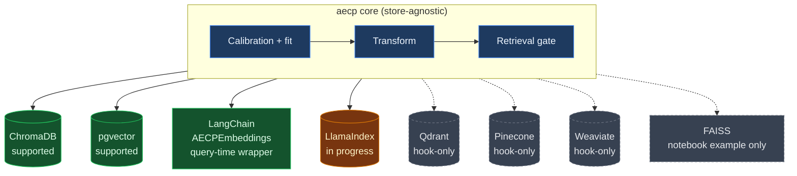

# AECP — Embedding migration without re-embedding

[](https://pypi.org/project/aecp/)
[](aecp-python/LICENSE)
[](aecp-python/)

Open-source toolkit to switch embedding models **without re-embedding your corpus**.
Learn a mapping from a small calibration sample, transform stored vectors in place,
and gate the migration on measured retrieval retention.

## The problem

Upgrading from `ada-002` to `text-embedding-3`, or swapping any embedding provider,
normally means re-embedding the entire corpus, re-indexing, and hoping nothing
breaks downstream. For any non-trivial vector store, that's an engineering project
nobody wants to own — not a config change. Most teams just... don't upgrade.

AECP learns a lightweight transform between the old and new embedding spaces from
a small calibration sample, applies it to your existing vectors, and reports the
retrieval retention (Recall@k, MRR) *before* you commit to the migration. If
retention doesn't clear your threshold, the gate fails and nothing ships.

## How it works



1. **Calibrate** — embed a small sample of your corpus (or a provided default set)
   with both the old and new models. No full-corpus embedding calls required.
2. **Fit** — learn a transform (Orthogonal Procrustes, ridge/affine, or a small
   residual model) mapping new-model space onto old-model space, or vice versa.
3. **Transform** — apply the learned map to your stored vectors in place, without
   touching the source text or calling the new embedding model on the full corpus.
4. **Gate** — measure retrieval retention against a held-out query set. The
   migration only proceeds if retention clears a configurable threshold; otherwise
   AECP reports why and falls back safely — your index is never left in a
   half-migrated state.

## Package

[`aecp-python/`](aecp-python/) — pip-installable as `aecp`.

```bash
pip install aecp
```

See [`aecp-python/README.md`](aecp-python/README.md) for the full quickstart,
CLI usage, and adapter-specific guides.

## Vector store adapters

AECP separates the transform logic (store-agnostic) from the adapter layer
(store-specific read/write), so the same learned mapping can be applied to
whatever you're actually running in production:



Solid arrows mean an in-place migration path exists today; dashed arrows mean
only a hook or example is available. See the status table for detail:

| Store | Status |
|---|---|
| ChromaDB | Supported |
| pgvector | Supported |
| LangChain (`AECPEmbeddings`) | Supported (query-time wrapper, store-agnostic) |
| LlamaIndex | In progress |
| Qdrant | Hook-only |
| Pinecone | Hook-only |
| Weaviate | Hook-only |
| FAISS | Notebook example only (no persistence layer to migrate against) |

## On claims and benchmarks

Quantitative performance claims in this repo appear **only** when backed by
committed artifacts under [`benchmarks/results/`](benchmarks/results/) and listed
in [`aecp-python/CLAIMS.md`](aecp-python/CLAIMS.md). If a number isn't in `CLAIMS.md` with a linked artifact, treat it
as unverified — that also means: don't take our word for it, rerun the gate on
your own corpus and model pair before you migrate.

## Prior art

AECP builds on [vec2vec](https://arxiv.org/abs/2505.12540), mini-vec2vec,
Drift-Adapter, and the Platonic Representation Hypothesis. Our contribution is
engineering — library, CLI, quality gate, adapters, and benchmarks — not
algorithmic novelty. If you're citing the underlying technique, cite that prior
work; if you're citing the tool, cite this repo.

## Status

Early-stage, actively developed. APIs may change between minor versions until
1.0. Issues and PRs welcome — see [`CONTRIBUTING.md`](CONTRIBUTING.md).

## License

Apache-2.0 (Python package). See [`aecp-python/LICENSE`](aecp-python/LICENSE).
