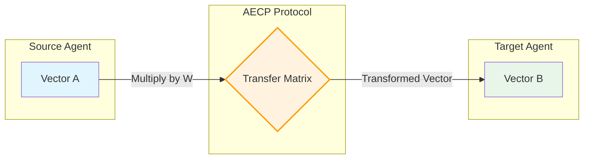

# AECP: Agent Embedding Communication Protocol

> **The standard for high-fidelity, privacy-preserving vector transfer between AI Agents.**

[](https://opensource.org/licenses/MIT)
[](https://pypi.org/project/aecp/)
[](https://www.npmjs.com/package/@aecp/core)

---

##  The Hidden Cost of Agent Swarms

**You have a problem.**

Imagine you have two specialized agents:
1.  **Agent A (Coder)**: Uses `voyage-code-2` to index and search your massive codebase.
2.  **Agent B (Architect)**: Uses `openai-text-embedding-3-small` for general reasoning and planning.

Agent A finds 50 critical code snippets relevant to a bug. It needs to pass this context to Agent B.

### The Old Way: Text Serialization (The Bottle Neck)

1.  Agent A finds vectors.
2.  Agent A **decodes** vectors to raw text (churning 20k tokens).
3.  Agent A sends 20k tokens of raw text to Agent B.
4.  Agent B **re-encodes** the text (latent again) to understand it.

**Why this fails:**
*    **Semantic Loss**: Subtle relationships captured by the code-specific model are flattened into generic text.
*    **Latency**: Re-encoding 20k tokens takes seconds.
*    **Privacy Risk**: Raw code leaves Agent A's secure boundary.
*    **Cost**: You pay for embedding tokens twice.

### The AECP Way: Mathematical Transfer

1.  Agent A finds vectors.
2.  Agent A applies a **Transfer Matrix** ($W_{A \to B}$).
3.  Agent A sends **vectors** to Agent B.
4.  Agent B uses them instantly.

**Why this wins:**
*    **97% Semantic Fidelity**: Mathematically aligned latent spaces preserve meaning better than text.
*    **Zero Latency**: Matrix multiplication is effectively instant ($O(1)$).
*    **Privacy**: Only abstract numbers are shared.
*    **Free**: Zero token costs.





---

##  Quick Start (Python)

AECP is Python-first, designed for the AI engineering ecosystem.

```bash
pip install aecp
```

### 1. The Handshake (One-time)
Agents exchange a standard set of "calibration anchors" to learn the translation layer.

```python
from aecp import AECP
from aecp.adapters import LocalModelAdapter
from sentence_transformers import SentenceTransformer

# Initialize your agents
agent_a = AECP(LocalModelAdapter(SentenceTransformer('all-MiniLM-L6-v2')))
agent_b = AECP(LocalModelAdapter(SentenceTransformer('all-mpnet-base-v2')))

# Learn the mathematical bridge (cached for future use)
transfer_matrix = agent_a.calibrate_with(agent_b)
```

### 2. The Transfer (Production)
Now Agent A can "speak" Agent B's language fluently.

```python
# Agent A retrieves a vector (e.g. from ChromaDB)
vector_a = agent_a.embed("Critical memory leak in buffer overflow")

# Translate to Agent B's space
vector_b = agent_a.transfer_to(agent_b, vector_a)

# Agent B uses it immediately - NO text exchange!
# results = agent_b.search(vector_b) 
```

---

##  Documentation & Spec

AECP is more than a library; it's a protocol.

*   **[Protocol Specification (RFC-001)](spec/RFC-001-AECP.md)**: The formal wire format and handshake definition.
*   **[Technical Whitepaper](AECP_TECHNICAL_OVERVIEW.md)**: The math behind the 97% fidelity claims.
*   **[Benchmarks](benchmarks/README.md)**: Reproducible proof of performance.

---

##  Integrations

Plug into your existing stack.

*   **[LangChain](integrations/langchain/)**: Use AECP agents as drop-in Embedding providers.
*   **[LlamaIndex](integrations/llamaindex/)**: Coming soon.
*   **[Next.js / TypeScript](aecp-npm/)**: Full support for JS/TS environments.

---

##  Comparison

| Metric | Text Handoff | AECP Transfer |
| :--- | :--- | :--- |
| **Speed** | ~2.5s (Re-encode) | **<10ms** (Matrix Mult) |
| **Fidelity** | ~85% (Lossy text) | **>95%** (Math preserved) |
| **Privacy** | Low (Text exposed) | **High** (Vectors only) |
| **Cost** | $$$ (Tokens) | **Free** |

---

##  Contributing

We welcome contributions! Please see [CONTRIBUTING.md](CONTRIBUTING.md) for details.

## License

MIT
