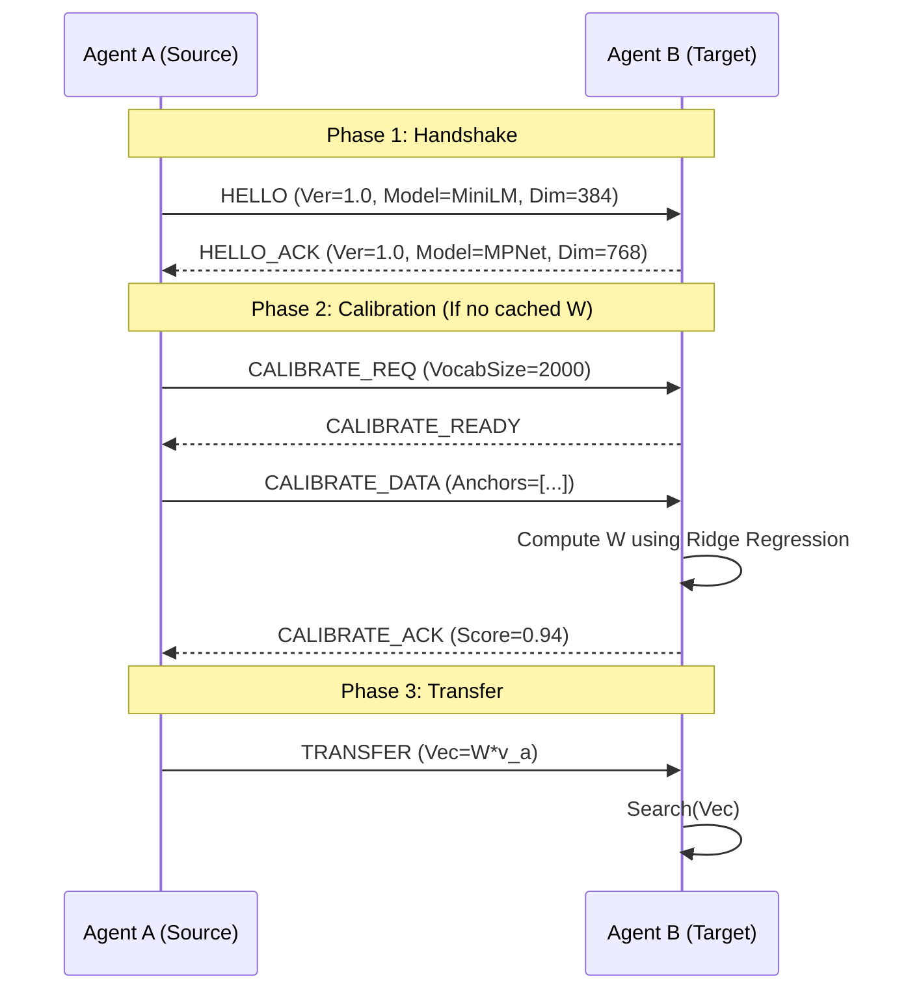

# AECP-001: Agent Embedding Communication Protocol

## Abstract

This document specifies the Agent Embedding Communication Protocol (AECP), a standard for semantic communication between autonomous agents using heterogeneous embedding models. The protocol defines a mechanism for agents to negotiate capabilities, calibrate linear transfer mappings (matrices), and exchange raw embedding vectors with high semantic fidelity (>93%), bypassing the need for lossy text re-serialization.

## 1. Introduction

As AI agents specialize, they increasingly rely on diverse embedding models (e.g., Voyage for code, OpenAI for general reasoning). Communication between these agents currently relies on natural language, which incurs high latency, privacy risks, and computational costs (re-encoding). AECP standardizes a "Vector-First" communication capability.

### 1.1 Terminology

The key words "MUST", "MUST NOT", "REQUIRED", "SHALL", "SHALL NOT", "SHOULD", "SHOULD NOT", "RECOMMENDED", "MAY", and "OPTIONAL" in this document are to be interpreted as described in RFC 2119.

*   **Agent**: An autonomous entity capable of generating and consuming embedding vectors.
*   **Calibration**: The process of learning a mapping between two embedding spaces.
*   **Transfer Matrix ($W$)**: A linear transformation matrix satisfying $y \approx Wx$.
*   **Fidelity**: The degree to which semantic nearest-neighbor relationships are preserved after transformation.

## 2. Protocol Flow

The protocol consists of three distinct phases: Handshake, Calibration, and Transfer.



## 3. Message Format

All messages MUST be serialized using JSON (for control messages) or specific binary formats (for large vector payloads).

### 3.1 Handshake (HELLO)

Sent to initiate a connection.

```json
{
  "type": "HELLO",
  "version": "1.0",
  "agent_id": "uuid-v4",
  "model": {
    "id": "all-MiniLM-L6-v2",
    "dimensions": 384,
    "framework": "sentence-transformers"
  }
}
```

### 3.2 Error Codes

Error codes are 4-digit integers grouped by phase.

| Code | Name | Description |
| :--- | :--- | :--- |
| **1000** | `HANDSHAKE_FAILED` | Incompatible protocol versions |
| **1001** | `MODEL_UNSUPPORTED` | Target cannot handle source model type |
| **2000** | `CALIBRATION_FAILED` | Ridge regression failed to converge |
| **2001** | `FIDELITY_TOO_LOW` | Validation score below 0.85 threshold |
| **3000** | `DIMENSION_MISMATCH` | Received vector size does not match negotiated dim |

## 4. Wire Format: Transfer Matrix

To ensure efficient storage and transmission, Transfer Matrices MUST be serialized as follows:

1.  **Header**: 16 bytes
    *   Magic Bytes (4 bytes): `AECP`
    *   Version (2 bytes): `0x0001`
    *   Rows (4 bytes, uint32): Output dimension ($d_{Target}$)
    *   Cols (4 bytes, uint32): Input dimension ($d_{Source}$)
    *   Precision (2 bytes): `0x0020` (Float32) or `0x0010` (Float16)
2.  **Payload**: Row-major raw byte array of floating point numbers.
3.  **Footer**: 32 bytes (SHA-256 Checksum of payload)

## 5. Security Considerations

### 5.1 Privacy
AECP provides a "Privacy Boundary" by transmitting abstract vectors rather than raw text. However, attackers with access to the Transfer Matrix and the Source Model could theoretically invert vectors to approximate text. Implementations SHOULD support ephemeral keys for session-based encryption of the vector stream.

### 5.2 Replay Attacks
All `TRANSFER` messages MUST include a monotonic sequence number or timestamp to prevent replay attacks.

## 6. Conformance

A "Reference Implementation" MUST support:
1.  Handshake negotiation for v1.0.
2.  Ridge Regression calibration with adaptive regularization ($\alpha = n/1000$).
3.  Support for at least one standard model family (HuggingFace/OpenAI).

## 7. Reference Implementations

*   **Python**: `aecp-python` (Primary Data Science Implementation)
*   **TypeScript**: `@aecp/core` (Production/Edge Implementation)
