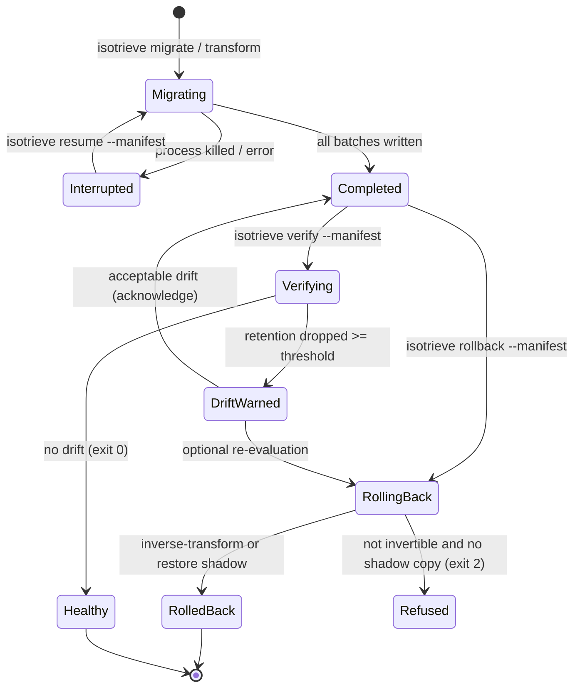

# Migration Lifecycle

Isotrieve migrations are first-class, resumable operations with an explicit
rollback story and post-migration drift checks. Every migration writes a
**manifest** that records the mapping, the store locations, whether the
transform is invertible, the rollback strategy, and the migration-time gate
result. The CLI commands below read and act on that manifest.

## State diagram



The manifest lives in `./isotrieve-manifests/<id>.json` by default
(overridable with `--dir` on every command).

## 1. Record

`migrate_store` (or `isotrieve transform` in a manifest-aware pipeline) writes
a `MigrationManifest` at the path you give it:

| Manifest field | Meaning |
|---|---|
| `id` | short timestamp + random id (`mig_YYYYMMDDTHHMMSSZ_xxxxxx`) |
| `mapping_path` | path to the `.isotrieve` transform used |
| `transform_invertible` | whether the transform has an analytic inverse |
| `rollback_strategy` | `shadow` / `inverse` / `snapshot` / `none` |
| `gate_result` | `GateReport.to_dict()` captured at migration time |
| `source_store` / `target_store` | store type + URI, so resume can reopen them |
| `batch_end` | resume cursor (next batch to write) |

## 2. Inspect

```bash
isotrieve manifest list
isotrieve manifest show <id>            # or --json
```

`list` scans the manifest directory and reports each migration's progress and
status (completed vs interrupted). `show` prints the full record including the
recorded gate result, so you can see *what* you shipped and *how confident*
the gate was.

## 3. Resume

If a migration is interrupted, it can be continued exactly where it left off —
no re-transform of already-written batches:

```bash
isotrieve resume --manifest <id>
```

`resume` reopens the source/target stores from the manifest (override with
`--source-dir` / `--target-dir`), reloads the mapping, and calls
`migrate_store(..., resume=True)`.

## 4. Roll back

```bash
isotrieve rollback --manifest <id>          # actually roll back
isotrieve rollback --manifest <id> --dry-run  # print the plan first
```

Rollback is **refused** (exit 2) when the transform is not invertible and no
shadow copy of the source was preserved:

```
Rollback refused: this migration cannot be rolled back.
  transform_invertible=False, rollback_strategy='none'.
```

You can roll back when:

- **Invertible transform** — target vectors are inverse-transformed back to
  source space (`strategy = "inverse"`, e.g. ridge/procrustes mappings).
- **Shadow copy** — the original source was preserved untouched
  (`strategy = "shadow"`, e.g. the Pinecone shadow-namespace strategy), and
  rollback restores it.

Recovered vectors are always written to a *new* directory
(`./isotrieve-rollback-<id>/` by default); live stores are never mutated.

## 5. Verify (post-migration drift)

```bash
# against fresh NPY corpora
isotrieve verify --manifest <id> \
    --queries live_queries.npy --corpus live_corpus.npy

# or re-read the migrated corpus from a store
isotrieve verify --manifest <id> \
    --queries live_queries.npy --live-store ./migrated_store
```

`verify` re-runs the quality gate on live query/corpus embeddings and compares
the live retention to the migration-time `gate_result` recorded in the
manifest. It reports a **DRIFT** warning (exit 1) when:

- live retention drops by `--drift-threshold` (default `0.10`) or more below
  the migration-time value, or
- live retention falls below `--warn-threshold` (default `0.55`).

Exit codes: `0` = no drift / PASS, `1` = drift warning (alert), `2` = usage
error.

### Scheduling drift checks

Run verify on a schedule so drift is caught before it reaches users:

```bash
# cron: 0 2 * * *  (daily 02:00)
isotrieve verify --manifest mig_20260725T020000_ab12cd \
    --queries live_queries.npy --corpus live_corpus.npy
```

In GitHub Actions:

```yaml
on:
  schedule:
    - cron: "0 2 * * *"
jobs:
  verify:
    runs-on: ubuntu-latest
    steps:
      - run: isotrieve verify --manifest $MANIFEST_ID --queries q.npy --corpus c.npy
```

Drift exit codes map naturally to CI: exit 1 fails the scheduled job and
triggers an alert; exit 0 keeps the pipeline green.

## What to do on drift

1. `isotrieve verify` tells you *how much* retention dropped and against which
   baseline.
2. If the drop is real, `isotrieve rollback --manifest <id> --dry-run` shows
   whether you can roll back, then roll back.
3. Re-calibrate with more in-domain texts and re-run the gate before
   re-migrating — see `docs/playbooks/` for model-specific guidance.
